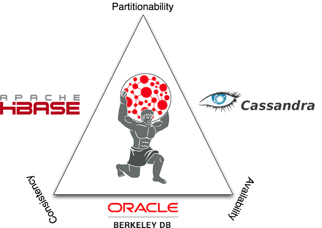

############
Introduction
############

.. highlight:: text

The Benefits of Titan
=====================

Titan is designed to support the processing of graphs so large that they require storage and computational capacities beyond what a single machine can provide. This is Titan's foundational benefit. This section will discuss the various specific benefits of Titan and its underlying, supported persistence solutions.

General Titan Benefits
----------------------

.. .. image:: _static/images/titan-kneeling.png
..   :align: right

* Support for very large graphs. Titan graphs scale with the number of machines in the cluster.
* Support for very many concurrent transactions. Titan's transactional capacity scale with the number of machines in the cluster. 
* Support for geo, numeric range, and full text search for vertices and edges on very large graphs.
* Native support for the popular property graph data model exposed by `Blueprints`_.
* Native support for the graph traversal language `Gremlin`_.
* Easy integration with the `Rexster`_ graph server for programming language agnostic connectivity.
* Numerous graph-level configurations provide knobs for tuning performance.
* Vertex-centric indices provide vertex-level querying to alleviate issues with the infamous `super node problem`_.
* Provides an optimized disk representation to allow for efficient use of storage and speed of access.
* Open source under the liberal `Apache 2 license`_.

.. _Blueprints: http://blueprints.tinkerpop.com
.. _Gremlin: http://gremlin.tinkerpop.com
.. _Rexster: http://rexster.tinkerpop.com
.. _TinkerPop: http://tinkerpop.com
.. _super node problem: http://thinkaurelius.com/2012/10/25/a-solution-to-the-supernode-problem/
.. _Apache 2 license: http://en.wikipedia.org/wiki/Apache_License
.. _Downloads: https://github.com/thinkaurelius/titan/wiki/Downloads

Benefits of Titan with Cassandra
--------------------------------

.. image:: http://cassandra.apache.org/media/img/cassandra_logo.png
   :target: http://cassandra.apache.org/

* `Continuously available`_ with no single point of failure.
* No read/write bottlenecks to the graph as there is no master/slave architecture.
* `Elastic scalability`_ allows for the introduction and removal of machines.
* Caching layer ensures that continuously accessed data is available in memory.
* Increase the size of the cache by adding more machines to the cluster.
* Integration with `Hadoop`_.
* Open source under the liberal Apache 2 license.

.. _Continuously available: http://en.wikipedia.org/wiki/Continuous_availability 
.. _Elastic scalability: http://en.wikipedia.org/wiki/Elastic_computing
.. _Hadoop: http://hadoop.apache.org/

Benefits of Titan with HBase
--------------------------------

.. image:: http://hbase.apache.org/images/hbase_logo.png
   :target: http://hbase.apache.org/

* Tight integration with the `Hadoop`_ ecosystem.
* Native support for `strong consistency`_.
* Linear scalability with the addition of more machines.
* `Strictly consistent`_ reads and writes.
* Convenient base classes for backing Hadoop `MapReduce`_ jobs with HBase tables.
* Support for exporting metrics via `JMX`_.
* Open source under the liberal Apache 2 license.

.. _strong consistency: http://en.wikipedia.org/wiki/Strong_consistency
.. _Strictly consistent: http://en.wikipedia.org/wiki/Strict_consistency
.. _MapReduce: http://en.wikipedia.org/wiki/MapReduce
.. _JMX: http://en.wikipedia.org/wiki/Java_Management_Extensions

Titan and the CAP Theorem
-------------------------

.. epigraph::

    "Despite your best efforts, your system will experience enough faults that it will have to make a choice between reducing yield (i.e., stop answering requests) and reducing harvest (i.e., giving answers based on incomplete data). This decision should be based on business requirements."

    -- `Coda Hale`_

When using a database, the `CAP theorem`_ should be thoroughly considered (C=Consistency, A=Availability, P=Partitionability). Titan is distributed with 3 supporting backends: `Cassandra`_, `HBase`_, and `BerkeleyDB`_. Their tradeoffs with respect to the CAP theorem are represented in the diagram below. Note that BerkeleyDB is a non-distributed database and as such, is typically only used with Titan for testing and exploration purposes.

.. _CAP theorem: http://en.wikipedia.org/wiki/CAP_theorem
.. _Cassandra: http://cassandra.apache.org/
.. _HBase: http://hbase.apache.org/
.. _BerkeleyDB: http://www.oracle.com/technetwork/products/berkeleydb/
.. _Coda Hale: http://codahale.com/you-cant-sacrifice-partition-tolerance

HBase gives preference to consistency at the expense of yield, i.e. the probability of completing a request. Cassandra gives preference to availability at the expense of harvest, i.e. the completeness of the answer to the query (data available/complete data).

Getting Started
===============

.. epigraph::

   In the beginning, there existed two deities known as `Uranus`_ and `Gaia`_. They gave birth to the `Titans`_ (a race of powerful beings).  `Saturn`_, Titan of time, set reality in motion. Ultimately, time yielded the existence of the sky, the sea, and the end of life--death. To rule these notions, Saturn had three sons: `Jupiter`_ (sky), `Neptune`_ (sea), and `Pluto`_ (underworld). The son's of Saturn were not Titans, but a race of seemingly less powerful deities known the world over as the Gods. Fearful that his sons would overthrow him, Saturn devoured them and imprisoned them in his stomach. This caused a `great war`_ between the Titans and Gods. Ultimately, the Gods won and Jupiter took the throne as leader of the Gods.

.. _Uranus: http://en.wikipedia.org/wiki/Uranus_(mythology)
.. _Gaia: http://en.wikipedia.org/wiki/Gaia_(mythology)
.. _Titans: http://en.wikipedia.org/wiki/Titan_(mythology)
.. _Saturn: http://en.wikipedia.org/wiki/Saturn_(mythology)
.. _Jupiter: http://en.wikipedia.org/wiki/Jupiter_(mythology)
.. _Pluto: http://en.wikipedia.org/wiki/Pluto_(mythology)
.. _Neptune: http://en.wikipedia.org/wiki/Neptune_(mythology)
.. _great war: http://en.wikipedia.org/wiki/Titanomachy

.. .. figure:: http://upload.wikimedia.org/wikipedia/commons/thumb/b/b3/8646_-_St_Petersburg_-_Hermitage_-_Jupiter2.jpg/180px-8646_-_St_Petersburg_-_Hermitage_-_Jupiter2.jpg
..    :align: right
.. 
..    Jupiter
.. 
.. .. figure:: http://upload.wikimedia.org/wikipedia/commons/thumb/6/68/Sousse_neptune.jpg/282px-Sousse_neptune.jpg
..    :align: right
.. 
..    Neptune
.. 
.. .. figure:: http://upload.wikimedia.org/wikipedia/commons/thumb/e/ed/Henryk_Siemiradzki_010.jpeg/320px-Henryk_Siemiradzki_010.jpeg
..    :align: right
.. 
..    Pluto

The Graph of the Gods
---------------------

The examples in this section make extensive use of a toy graph distributed with Titan called *The Graph of the Gods*. This graph is diagrammed below. The abstract data model is known as a `property graph <Property Graph Model_>`_ and this particular instance describes the relationships between the beings and places of the Roman pantheon. Moreover, special text and symbol modifiers in the diagram (e.g. bold, underline, etc.) denote different schematics/typings in the graph.

.. figure:: _static/images/graph-of-the-gods-2.png
   :align: center
   :figclass: figure-with-border

   **Legend**

   +-------------------+----------------------------------------------------------+
   |visual symbol      |                   meaning                                |
   +===================+==========================================================+
   |bold key           |a graph indexed key                                       |
   +-------------------+----------------------------------------------------------+
   |bold key with star |a graph indexed key that must have a unique value         |
   +-------------------+----------------------------------------------------------+
   |underlined key     |a vertex-centric indexed key                              |
   +-------------------+----------------------------------------------------------+
   |hollow-head edge   |a functional/unique edge (no duplicates)                  |
   +-------------------+----------------------------------------------------------+
   |tail-crossed edge  |a unidirectional edge (can only traverse in one direction)|
   +-------------------+----------------------------------------------------------+

Downloading Titan and Running the Gremlin Shell
-----------------------------------------------

   Unbeknownst to the Gods, there still lived one Titan. This Titan can not be seen, has no name, and is only apparent in the fact that reality exists. Upon the shoulders of this lost Titan, all of reality hangs together in an undulating web of relations.

Titan can be downloaded from the `Downloads`_ section of the project repository. Once retrieved and unpacked, a `Gremlin`_ terminal can be started. The Gremlin `REPL`_ (i.e. interactive shell) is distributed with Titan and differs slightly from the main `TinkerPop`_ Gremlin distribution in that is comes preloaded with Titan-specific ``imports`` and helper methods. In the example below, ``titan.zip`` is used, however, be sure to unzip the zip-file that was downloaded.

.. _REPL: http://en.wikipedia.org/wiki/Read%E2%80%93eval%E2%80%93print_loop

.. code-block:: text

   $ unzip titan.zip
   Archive:  titan.zip
      creating: titan/
   ...
   $ cd titan
   $ bin/gremlin.sh 
   
            \,,,/
            (o o)
   -----oOOo-(_)-oOOo-----
   gremlin>

The Gremlin terminal is a `Groovy`_ shell. Groovy is a superset of Java that has various shorthand notations that make interactive programming easier. Likewise Gremlin is a superset of Groovy with various shorthand notations that make graph traversals easy. The basic examples below demonstrate handling numbers, strings, and maps. The remainder of the tutorial will discuss graph-specific constructs.

.. _Groovy: http://groovy.codehaus.org/

.. code-block:: text

   gremlin> 100-10
   ==>90
   gremlin> "Titan:" + " The Rise of Big Graph Data"
   ==>Titan: The Rise of Big Graph Data
   gremlin> [name:'aurelius',vocation:['philosopher','emperor']]
   ==>name=aurelius
   ==>vocation=[philosopher, emperor]

*NOTE*: Please refer to `GremlinDocs`_ for a easy to use Gremlin reference.

.. _GremlinDocs: http://gremlindocs.com

Loading Data Into Titan
-----------------------

The example below will load *The Graph of the Gods* dataset diagrammed above into Titan. When working with a fresh graph (beyond this tutorial), ``TitanFactory`` provides methods to create various Titan instances (e.g. local, distributed, etc.). A local, single machine instance of Titan is created using the ``TitanFactory.open(String directory)`` method. Other pages in the documentation demonstrate distributing Titan across multiple machines, for instance [[using Cassandra]] or [[using HBase]]. Refer to the [[storage backend overview]] on how to choose the optimal persistence mode. For the purpose of this tutorial, a pre-constructed local graph is provided that is loaded with the above *Graph of the Gods* diagram.

.. code-block:: text

   gremlin> g = GraphOfTheGodsFactory.create('/tmp/titan')           
   ==>titangraph[local:/tmp/titan]

The ``GraphOfTheGodsFactory.create()`` method does the following to the newly constructed graph prior to returning it:

  # Creates a collection of global and vertex-centric indices on the graph.
  # Adds all the vertices to the graph along with their properties.
  # Adds all the edges to the graph along with their properties.

Please see the `GraphOfTheGodsFactory source code`_ for details.

.. _GraphOfTheGodsFactory source code: https://github.com/thinkaurelius/titan/blob/master/titan-core/src/main/java/com/thinkaurelius/titan/example/GraphOfTheGodsFactory.java

For those using Titan/Cassandra (or Titan/HBase), be sure to make use of ``bin/cassandra-es.local`` (or ``bin/hbase-es.local``) and ``GraphOfTheGodsFactory.load()``.

.. code-block:: text

   gremlin> g = TitanFactory.open('bin/cassandra-es.local')
   ==>titangraph[cassandrathrift:127.0.0.1]
   gremlin> GraphOfTheGodsFactory.load(g)
   ==>null

Global Graph Indices
--------------------

The typical pattern for accessing data in a graph database is to first locate the entry point into the graph using a graph index. That entry point is an element (or set of elements) -- i.e. a vertex or edge. From the entry elements, a Gremlin path description describes how to traverse to other elements in the graph via the explicit graph structure.

Given that there is a unique index on ``name`` property, the Saturn vertex can be retrieved. The property map (i.e. the key/value pairs of Saturn) can then be examined. As demonstrated, the Saturn vertex has a ``name`` of "saturn," an ``age`` of 10000, and a ``type`` of "titan." The grandchild of Saturn can be retrieved with a traversal that expresses: "Who is Saturn's grandchild?" (the inverse of "father" is "child"). The result is Hercules.

.. code-block:: text

   gremlin> saturn = g.V('name','saturn').next()
   ==>v[4]
   gremlin> saturn.map()
   ==>name=saturn
   ==>age=10000
   ==>type=titan
   gremlin> saturn.in('father').in('father').name
   ==>hercules

The property ``place`` is also in a graph index. The property ``place`` is an edge property. Therefore, Titan can index edges in a graph index. It is possible to query *The Graph of the Gods* for all events that have happened within 50 kilometers of `Athens`_ (latitude:37.97 and long:23.72). Then, given that information, which vertices were involved in those events.

.. _Athens: http://en.wikipedia.org/wiki/Athens

.. code-block:: text

   gremlin> g.query().has('place',WITHIN,Geoshape.circle(37.97,23.72,50)).edges()
   ==>e[2T-o-2F0LaTPQBM][24-battled->40]
   ==>e[2R-o-2F0LaTPQBM][24-battled->36]
   gremlin> g.query().has('place',WITHIN,Geoshape.circle(37.97,23.72,50)).edges().collect {
      it.bothV.name.next(2) 
   }
   ==>[hercules, hydra]
   ==>[hercules, nemean]

Graph indices are one type of index structure in Titan. Graph indices are accessible via the ``Graph.query()`` method. The second aspect of indexing in Titan is known as vertex-centric indices. Vertex-centric indices are accessible via the ``Vertex.query()`` method. Vertex-centric indices are described later.

Graph Traversal Examples
------------------------

.. epigraph::

   `Hercules`_, son of Jupiter and `Alcmene`_, bore super human strength. Hercules was a `Demigod`_ because his father was a god and his mother was a human. `Juno`_, wife of Jupiter, was furious with Jupiter's infidelity. In revenge, she blinded Hercules with temporary insanity and caused him to kill his wife and children. To atone for the slaying, Hercules was ordered by the `Oracle of Delphi`_ to serve `Eurystheus`_. Eurystheus appointed Hercules to 12 labors.

.. _Hercules: http://en.wikipedia.org/wiki/Hercules
.. _Alcmene: http://en.wikipedia.org/wiki/Alcmene
.. _Demigod: http://en.wikipedia.org/wiki/Demigod
.. _Juno: http://en.wikipedia.org/wiki/Juno_(mythology)
.. _Eurystheus: http://en.wikipedia.org/wiki/Eurystheus
.. _Oracle of Delphi: http://en.wikipedia.org/wiki/Oracle_at_Delphi

.. .. figure:: http://upload.wikimedia.org/wikipedia/commons/thumb/1/10/Mosaico_Trabajos_H%C3%A9rcules_%28M.A.N._Madrid%29_01.jpg/301px-Mosaico_Trabajos_H%C3%A9rcules_%28M.A.N._Madrid%29_01.jpg
..    :align: right
.. 
..    Nemean
.. 
.. .. figure:: http://upload.wikimedia.org/wikipedia/commons/thumb/2/23/Hercules_slaying_the_Hydra.jpg/320px-Hercules_slaying_the_Hydra.jpg
..   :align: right
..
..   Hydra
.. 
.. .. figure:: http://upload.wikimedia.org/wikipedia/commons/thumb/2/25/Cerberus-Blake.jpeg/320px-Cerberus-Blake.jpeg
..    :align: right
.. 
..    Cerberus

In the previous section, it was demonstrated that Saturn's grandchild was Hercules. This can be expressed using a ``loop``. In essence, Hercules is the vertex that is 2-steps away from Saturn along the ``in('father')`` path.

.. code-block:: text

   gremlin> hercules = saturn.as('x').in('father').loop('x'){it.loops < 3}.next()
   ==>v[24]

Hercules is a demigod. To prove that Hercules is half human and half god, his parent's origins must be examined. It is possible to traverse from the Hercules vertex to his mother and father. Finally, it is possible to determine the ``type`` of each of them -- yielding "god" and "human."

.. code-block:: text

   gremlin> hercules.out('father','mother')
   ==>v[16]
   ==>v[28]
   gremlin> hercules.out('father','mother').name
   ==>jupiter
   ==>alcmene
   gremlin> hercules.out('father','mother').type
   ==>god
   ==>human
   gremlin> hercules.type
   ==>demigod

The examples thus far have been with respect to the genetic lines of the various actors in the Roman pantheon. The `Property Graph Model`_ is expressive enough to represent multiple types of things and relationships. In this way, *The Graph of the Gods* also identifies Hercules' various heroic exploits --- his famous 12 labors. In the previous section, it was discovered that Hercules was involved in two battles near Athens. It is possible to explore these events by traversing ``battled`` edges out of the Hercules vertex.

.. code-block:: text

   gremlin> hercules.out('battled')
   ==>v[36]
   ==>v[40]
   ==>v[44]
   gremlin> hercules.out('battled').map
   ==>{name=nemean, type=monster}
   ==>{name=hydra, type=monster}
   ==>{name=cerberus, type=monster}
   gremlin> hercules.outE('battled').has('time',T.gt,1).inV.name
   ==>hydra
   ==>cerberus

The edge property ``time`` on ``battled`` edges is indexed by the vertex-centric indices of a vertex. Retrieving ``battled`` edges incident to Hercules according to a constraint/filter on ``time`` is faster than doing a linear scan of all edges and filtering  (typically ``O(log n)``, where ``n`` is the number incident edges). Gremlin is intelligent enough to use vertex-centric indices when available. A ``toString()`` of a Gremlin expression shows the underlying `query pipeline <Pipes_>`_

.. code-block:: text

   gremlin> hercules.outE('battled').has('time',T.gt,1).inV.name.toString()
   ==>[StartPipe, VertexQueryPipe(out,[battled],has,edge), IdentityPipe, InVertexPipe, PropertyPipe(name)]

.. _Pipes: http://pipes.tinkerpop.com

More Complex Graph Traversal Examples
-------------------------------------

.. epigraph::

   In the depths of Tartarus lives Pluto. His relationship with Hercules was strained by the fact that Hercules battled his pet, Cerberus. However, Hercules is his nephew -- how should he make Hercules pay for his insolence?

The Gremlin traversals below provide more examples over *The Graph of the Gods*. The explanation of each traversal is provided in the prior line as a ``//`` comment. 

.. .. image:: http://upload.wikimedia.org/wikipedia/commons/9/93/Agostino_Carracci_01.jpg
..   :align: right

Cohabiters of Tartarus
^^^^^^^^^^^^^^^^^^^^^^

.. code-block:: text

   gremlin> pluto = g.V('name','pluto').next()
   ==>v[32]
   gremlin> // who are pluto's cohabitants?
   gremlin> pluto.out('lives').in('lives').name                
   ==>pluto
   ==>cerberus
   gremlin> // pluto can't be his own cohabitant
   gremlin> pluto.out('lives').in('lives').except([pluto]).name
   ==>cerberus
   gremlin> pluto.as('x').out('lives').in('lives').except('x').name
   ==>cerberus

Pluto's Brothers
^^^^^^^^^^^^^^^^

.. code-block:: text

   gremlin> // where do pluto's brothers live?
   gremlin> pluto.out('brother').out('lives').name
   ==>sky
   ==>sea
   gremlin> // which brother lives in which place?
   gremlin> pluto.out('brother').as('god').out('lives').as('place').select
   ==>[god:v[16], place:v[8]]
   ==>[god:v[20], place:v[12]]
   gremlin> // what is the name of the brother and the name of the place?
   gremlin> pluto.out('brother').as('god').out('lives').as('place').select{it.name}
   ==>[god:jupiter, place:sky]
   ==>[god:neptune, place:sea]

Finally, Pluto lives in Tartarus because he shows no concern for death. His brothers, on the other hand, chose their locations based upon their love for certain qualities of those locations.

.. code-block:: text

   gremlin> pluto.outE('lives').reason
   ==>no fear of death
   gremlin> g.query().has('reason',CONTAINS,'loves').edges()
   ==>e[2B-g-2F0LaTPQBU][16-lives->8]
   ==>e[2H-k-2F0LaTPQBU][20-lives->12]
   gremlin> g.query().has('reason',CONTAINS,'loves').edges().collect{
     [it.outV.name.next(),it.reason,it.inV.name.next()] 
   }
   ==>[jupiter, loves fresh breezes, sky]
   ==>[neptune, loves waves, sea]

Next Steps
----------

This section presented some basic examples of how to traverse *The Graph of the Gods* in Titan. In essence, a graph database is all about representing some world (structure) and traversing it to solve problems (process). 

* Learn more about [[Titan's core interface | Blueprints Interface]]
* Read about choosing a [[Titan storage backend | Storage Backend Overview]]
* Read more about Gremlin via its "wiki":http://gremlin.tinkerpop.com and "GremlinDocs":http://gremlindocs.com

Additional Background and Orientation Resources
===============================================

Here are some external resources with information about Titan, the TinkerPop stack, and the graph data model:

* `Introduction to Titan Video`_
* `Brief Primer on Graph Databases`_
* The `Property Graph Model`_
* `Big Graph Data Presentation`_

.. _Introduction to Titan Video: http://www.youtube.com/watch?v=ZkAYA4Kd8JE
.. _Brief Primer on Graph Databases: http://markorodriguez.com/2011/04/30/putting-and-getting-data-from-a-database/
.. _Property Graph Model: https://github.com/tinkerpop/blueprints/wiki/Property-Graph-Model
.. _Big Graph Data Presentation: http://www.slideshare.net/slidarko/titan-the-rise-of-big-graph-data
